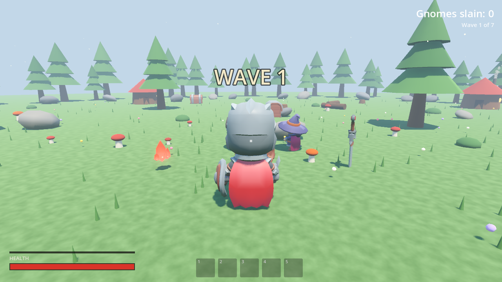

# Gnome Slayer (Гномобой)

A co-op 3D action game built with **Godot 4.7**: you are a knight facing hordes of surprisingly well-organized gnomes. Single-player and full multiplayer — PvE co-op and PvP — with **Windows ↔ Linux crossplay**, positional voice chat, and a 6-chapter story campaign with three endings.

**Current version: 4.3.0** · [Play on itch.io](https://itch.io) (search "Gnome Slayer") · Assets: CC0 by [Kay Lousberg](https://kaylousberg.com)



## Table of contents

- [Game modes](#game-modes)
- [Features](#features)
- [Controls](#controls)
- [Multiplayer](#multiplayer)
- [Story campaign](#story-campaign)
- [Progression](#progression)
- [World & points of interest](#world--points-of-interest)
- [Combat](#combat)
- [Running the game](#running-the-game)
- [Building from source](#building-from-source)
- [Testing](#testing)
- [Architecture notes](#architecture-notes)
- [Project layout](#project-layout)
- [Credits & licenses](#credits--licenses)

## Game modes

| Mode | Description |
|---|---|
| **Story — Shards of the Mountain Heart** | 6 chapters as a real journey: a large multi-area overworld with a road, gates, settlements and a crypt dungeon at the far end; camp NPCs, side quests, a merchant, 3 endings. Solo or co-op. |
| **Waves (PvE)** | Survive 7 growing waves of enemies, alone or with friends. |
| **PvP** | Arena duel with ruins — first to 10 kills. Gnomes interfere with everyone. |

## Features

- **Windows ↔ Linux crossplay** — the host opens a single UDP port, or everyone connects over Radmin VPN / LAN. Version mismatch is detected at connect time with a clear error.
- **Voice chat** (push-to-talk) with microphone selection, gain control, a mic test, positional audio, and automatic game-audio ducking while someone speaks. Text chat included.
- **Retro dialogue "voice"** — dialogue and cutscene lines type out letter by letter with a procedurally synthesized blip, like classic JRPGs. No recorded or AI-generated voices.
- **Cinematic cutscenes** between chapters: letterboxed multi-shot camera work, subtitle timing that scales with line length, HUD fully hidden.
- **Day/night cycle** — a full day in 8 minutes with sunrises, golden sunsets, a starry sky and a cratered moon; house windows light up at dusk; time is synchronized between players.
- **4 biomes** with unique enemy rosters: meadow, winter forest, autumn forest, night graveyard.
- **Journey overworld** (story): a 120-radius multi-area world — camp, settlement, battlefield, grove and the dungeon approach — connected by a path-tile road with fence gates; campfires serve as respawn checkpoints; enemies are leashed to their home areas.
- **Procedural crypt dungeons**: rooms + corridors from the Dungeon Remastered kit, torch-lit, with spike traps, loot rooms and a boss hall; the whole party descends together and portals back after claiming the shard.
- **Full inventory & equipment** (I key): 20-slot grid, weapon + trinket slots, 6 weapon classes incl. a ranged crossbow (sword&shield, axe&shield, dagger, two-handed sword, battle axe, crossbow), 4 rarity tiers with deterministic affixes — forged saves can't fake stats.
- **Merchant at camp**: seed-rolled stock per chapter, buy gear/potions, sell loot for squad gold.
- **8 kinds of interactive points of interest**, spread across overworld areas.
- **19 achievements**, from first blood to collecting all of a map's lore.
- **24 lore fragments** scattered across ruins, standing stones, crypts and battlefields.
- **Hero persistence** — 3 save slots; in multiplayer every player brings their own knight from their own slot.
- **Localization**: English, Ukrainian, Russian — switchable at runtime.
- **Discord Rich Presence + Join** out of the box on Windows and Linux (chapter/wave, party size, session time). When hosting an **Open** session, friends can join straight from Discord — the game receives the invite secret and connects automatically. Choose **Open** or **Private** when creating a server. Ships with a built-in Application ID; you can set your own in Settings → General. For Discord's "Go Live" stream button to target the game, add it once under Discord → Settings → Registered Games → "Add it!".
- **Performance controls**: FSR2 render scale, MSAA, SSAO/bloom toggles, shadow quality.

## Controls

All bindings are remappable in Settings.

| Key | Action |
|---|---|
| W A S D | Move |
| Mouse | Camera |
| LMB | Attack (3-hit combo) |
| RMB (hold) | Shield block |
| Space | Dodge roll (i-frames) |
| Shift | Sprint |
| E (hold) | Revive a downed friend / interact |
| V (hold) | Voice chat |
| T | Text chat |
| C | Character sheet (stats & skill tree) |
| I | Inventory & equipment |
| 1–5 | Hotbar items |
| Esc | Pause / menu |

## Multiplayer

**Host:** menu → *Host server* → pick mode (PvE/PvP) and port (default UDP 7788). The host's IP addresses are shown in the menu.
**Join:** host IP + port — via port forwarding or Radmin VPN / LAN.

Co-op specifics:

- A defeated player doesn't die — they are **downed**. Walk up and hold **E** for three seconds (both players see a progress bar) to revive them at half health. Anyone still down when a new wave starts gets up automatically, or self-revives after 40 seconds.
- **Golden Feast** is a party-wide item: fully heals the living and revives all downed players.
- Chest loot is shared — **the whole party receives items** from an opened chest, no loot fights.
- If everyone is down at once, the run is lost.

## Story campaign

King Dungrim of the gnomes, hungry for power, shattered the Mountain Heart — the crystal that fed their lands — and the shard-scattered darkness drove the tribe mad. Six chapters: Meadow → Autumn → Winter → Night → the night **Siege of the Meadow** → the **Lich's Lair**.

Each chapter has:

- a **camp** with a fire and NPCs (a herbalist, a peaceful gnome blacksmith, a huntress — and in the finale, the ghost of King Dungrim himself), with dialogue and `!`/`?` quest markers;
- a **main quest** chain: talk → thin the horde → kill the shard-guardian boss → pick up the shard → turn it in;
- **side quests**: gather glowing mushrooms, recover a stolen hammer, light signal fires, stomp a bone swarm — rewarding XP and bombs for the whole party;
- a **portal finale** — the chapter ends when you physically walk into the portal, with a short cutscene, not an instant teleport.

**Three endings** based on side quests completed across the whole campaign: Bitter (< 3), Bright (3–5), Golden (all 6) — each with its own epilogue.

## Progression

XP is earned by the whole party for kills, quests and chapters. Each level (up to 15) grants +4 max HP and a **stat point** (character sheet on **C**):

| Stat | Effect per point |
|---|---|
| Strength | +6% damage |
| Vitality | +12 max HP |
| Agility | +4% speed, shorter dodge cooldown |
| Luck | +2% crit chance |

On top of stats there is a **branching skill tree** (2 tiers per branch) with damage, HP, speed, dodge, revive-speed, gold-find and crit-damage nodes, gated by stat investment.

**Enemies level too** — scaling with the story chapter or survival wave (a "lvl N" tag above their heads): more HP, more damage, more XP per kill.

## World & points of interest

Every arena (except the camp) is **procedurally generated from the server's seed** — house placement, trees, chests, points of interest. The same seed produces the same world on every client, so no geometry is sent over the network.

Each map rolls **4 points of interest out of 8 kinds**:

| POI | Interaction |
|---|---|
| Shrine | Ask for a blessing — a temporary speed + rage buff (per-shrine cooldown) |
| Campfire | Warm up — instant heal + a short shield (cooldown) |
| Old well | Drink — a bigger heal, shorter cooldown |
| Bounty board | Accept a one-per-match contract — an **elite gnome** spawns nearby |
| Ruins | Examine for a lore fragment |
| Standing stones | Examine for a lore fragment |
| Crypt | Examine for a lore fragment |
| Battlefield | Examine for a lore fragment |

Lore fragments are deterministic per seed, tracked per profile (24 total), and reading all of them unlocks an achievement.

## Combat

- 3-hit melee combos, shield blocking (directional), dodge rolls with i-frames, temporary buffs (rage, speed, barrier, greatsword).
- **Elite gnomes** — a rare (~7%) golden variant: 1.8× HP, +35% damage, a golden glow, guaranteed rich loot, its own achievement.
- **Finisher** — hitting a staggered enemy deals 40% bonus damage.
- **Bosses have unique special attacks**: ground slam (AoE), charge, summoning adds — telegraphed with a wind-up so you can dodge.
- **Second Wind** — once per match, dropping below 25% HP grants an emergency shield + rage + speed burst.
- Hireable **ally mages** with their own leveling (kills → levels → stronger heals/bolts) and a leash so they don't chase enemies across the map.
- Enemy AI: navmesh pathfinding, sight and hearing, sound investigation, group alerts, surround-by-slots, a cap on simultaneous attackers, dodging scouts, healing shamans. Enemies exit their houses through doors that actually open; corpses ragdoll.

## Running the game

Download the packaged builds from itch.io, or after building from source:

- **Windows:** run `build/Gnomoboy.exe`.
- **Linux:**
  ```bash
  chmod +x Gnomoboy.x86_64
  ./Gnomoboy.x86_64
  ```
  Requires a Vulkan-capable driver. Discord presence on Linux uses `python3` (present on virtually every desktop distro); without it the game simply runs without Discord status.

## Building from source

You need the Godot 4.7 editor/console binary and export templates. From the project root:

```bash
# Import assets (first run)
godot --headless --path . --import

# Export release builds (presets are configured in export_presets.cfg)
godot --headless --path . --export-release "Windows Desktop" build/Gnomoboy.exe
godot --headless --path . --export-release "Linux" build/Gnomoboy.x86_64
```

To open the project in the editor: `godot --path . -e`

The Windows exe ships with an icon, version metadata and an Authenticode signature (self-signed `CN=Nikita Games` + DigiCert timestamp). For a SmartScreen-trusted build you'd need a purchased OV/EV certificate with the same signing command:

```powershell
Set-AuthenticodeSignature -FilePath build\Gnomoboy.exe -Certificate <cert> -TimestampServer http://timestamp.digicert.com -HashAlgorithm SHA256
```

## Testing

The game has a headless test harness — no window, no manual clicking:

```bash
# PvE smoke test: spawns, input, pause, chests, items, kills, corpses
godot --headless --path . -- --test

# Story test: full chapter loop — quests, hiring, safe zone, boss, shard,
# portal, chapter transition, saves, stats, POI interactions, elite/finisher
godot --headless --path . -- --test-story

# Multiplayer: run in two terminals
godot --headless --path . -- --mphost
godot --headless --path . -- --mpjoin
```

Tests print `[TEST] ... PASS=true/false` lines to stdout. Test saves are written to Godot's user data dir (`user://test_*.cfg`) — delete them for a clean baseline.

## Architecture notes

- **Networking:** ENet with range-coder compression, listen-server (the host is server + player 1). The server is **authoritative**: all damage, HP, crits, cooldowns, loot and gold are computed server-side; clients only send intents ("I hit target X").
- **State replication:** gnome batches are **delta-compressed** (only changed entries are sent, a full frame once per second); player/gnome states travel as compact `PackedFloat32Array`s with adaptive rates (20 Hz moving, 5 Hz idle).
- **Voice:** μ-law 8-bit @ ~11 kHz on a dedicated unreliable channel, positional playback.
- **World generation:** seed-driven; interactive objects (chests, POIs) register into obstacle/POI lists that feed both collision and the navmesh, which rebakes asynchronously when obstacles appear (guarded against double-baking).
- **Saves:** ConfigFile-based, 3 slots, written only on meaningful events plus every 30 seconds — no mid-combat hitches.
- **UI:** the entire interface (menu, HUD, dialogs, skill tree) is built in code — no scene files to merge-conflict.
- **Localization:** a single CSV (`locale/translations.csv`) with keys+ru+uk+en, compiled by Godot into `.translation` resources at import.

## Project layout

```
project.godot            Godot project config (autoloads, display, locale)
main.tscn                Single scene; everything else is built in code
scripts/
  main.gd                Menu, settings UI, test harness, cmdline handling
  game.gd                Match orchestration: server logic, RPCs, waves, story
  net.gd                 Networking: ENet setup, RPC definitions, version check
  player.gd              Player character: input, combat, animation, camera
  gnome.gd               Enemy/ally AI: state machine, specials, ragdolls
  npc.gd                 Camp NPCs and dialogue hooks
  world_gen.gd           Procedural arena generation, POIs, biomes
  quests.gd              Campaign data: chapters, dialogues, lore, multipliers
  skills.gd              Skill tree definitions and stat multipliers
  achievements.gd        Achievement definitions, unlock tracking (autoload)
  savegame.gd            Save slots, hero persistence (autoload)
  hud.gd                 In-game UI: bars, chat, dialogs, cutscene letterbox
  settings.gd            Persistent settings + keybinds (autoload)
  sfx.gd / music.gd      Pooled sound playback / generative music (autoloads)
  voice.gd               Voice chat capture/playback (autoload)
  daynight.gd            Day/night cycle
  discord.gd             Discord Rich Presence bridge (autoload)
  ui_theme.gd            Shared UI theme
locale/translations.csv  All strings: keys, Russian, Ukrainian, English
models/                  CC0 glTF assets (KayKit packs)
assets/sfx, assets/music Procedurally generated WAV files
shaders/sky.gdshader     Sky shader (day/night, stars, moon)
promo/                   Store-page text, screenshots, release notes
```

## Credits & licenses

- **Code, game design, procedural audio:** Nikita Games. Built with AI-assisted development (Claude Code); see the itch.io page for the full AI disclosure.
- **3D assets** — all CC0, hand-made by [Kay Lousberg](https://kaylousberg.com):
  - [KayKit Character Pack: Adventurers](https://github.com/KayKit-Game-Assets/KayKit-Character-Pack-Adventures-1.0) — hero and gnome models
  - [KayKit Character Pack: Skeletons](https://github.com/KayKit-Game-Assets/KayKit-Character-Pack-Skeletons-1.0) — skeleton enemies and weapons
  - [KayKit Dungeon Remastered](https://github.com/KayKit-Game-Assets/KayKit-Dungeon-Remastered-1.0) — chests, props, portal arch, ruins, banners
  - [KayKit Halloween Bits](https://github.com/KayKit-Game-Assets/KayKit-Halloween-Bits-1.0) — graveyard props, autumn/dead trees, pumpkins
- **Engine:** [Godot Engine 4.7](https://godotengine.org) (MIT).

Sound effects and music are generated procedurally (no sampled or third-party audio). Leaves, crystals and most world detail are runtime-built meshes (SurfaceTool), not imported primitives.
